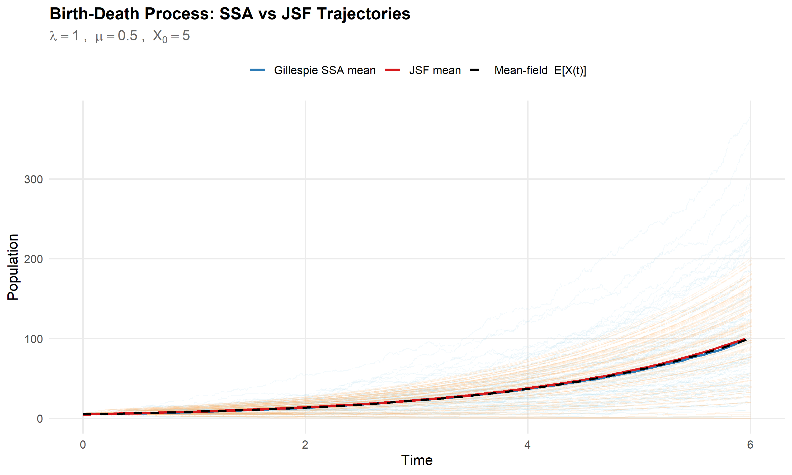
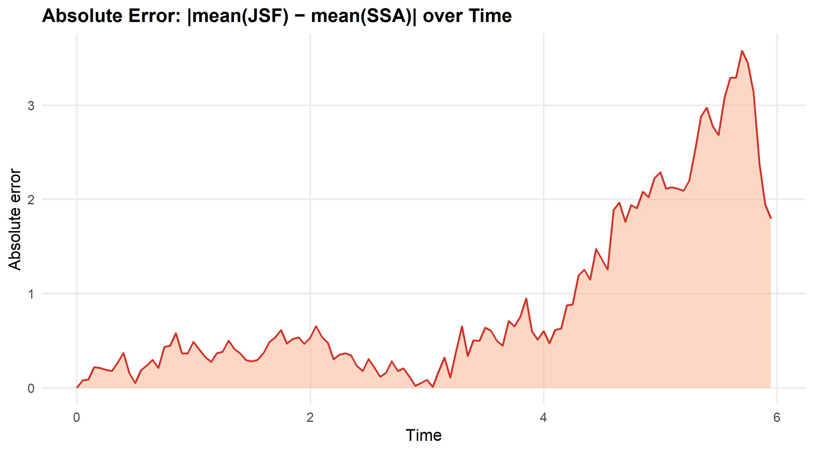
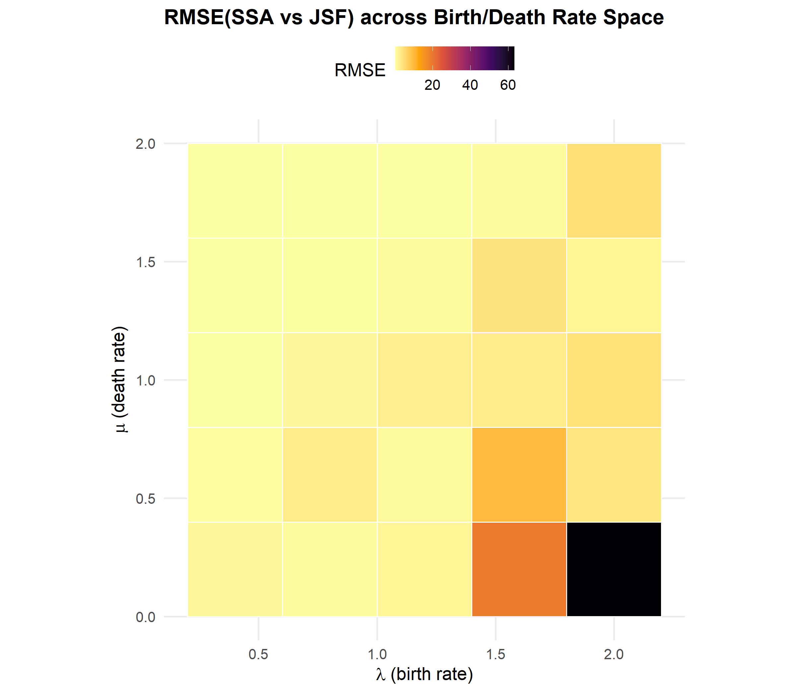

## Test Solutions

### 1. Easy Test: `example.qmd`

Uses the Python `jsf` package in R through `reticulate` in a Quarto report.
- **View Live:** [https://vai-man.github.io/jsf-tests/example.html](https://vai-man.github.io/jsf-tests/example.html)
- **Install Quarto (if needed):**
  ```r
  install.packages("quarto")
  quarto::install_quarto()
  ```
- **Run it:** Open `example.qmd` in RStudio and click "Render" (or run `quarto::quarto_render("example.qmd")`).
- **Features:** Simulates a Birth-Death process and a Lotka-Volterra predator-prey system with graphs and mean-field comparisons.

### 2. Medium Test: `jsfR` Package

An R package that wraps the Python JSF code using `reticulate`.
- **Run Unit Tests:** `devtools::test("jsfR")`
- **Compile Documentation:** `devtools::document("jsfR")`
- **Features:** Loads Python modules safely, validates inputs rigorously, seamlessly translates complex array structures between R and Python in the background, and provides integrated `ggplot2` mapping functions for visualization.

### 3. Hard Test: Gillespie SSA Comparison

Compares an exact R simulator (Gillespie SSA) against JSF output to measure differences. Uses the `jsfR` package.
- **Run it:** 
  ```r
  # Ensure the package is loaded via library(jsfR) before sourcing
  source("hard_test.R")
  ```
- **Output:** Runs simulations, caches 3,000 Python JSF calls, saves comparison plots to `output/`, and creates a CSV file with results.

#### Resulting Comparisons:

**1. Overlaying Individual Trajectories**
*(Gillespie SSA vs JSF vs analytical Mean-Field)*


**2. Absolute Error Over Time**
*(Mathematical difference between R and Python simulators over the simulation horizon)*


**3. Parameter Sweep RMSE Heatmap**
*(Computing algorithmic error across varying growth/death rates)*


## Requirements

R `4.1+`, Python `3.8+`, Quarto, and the following R packages:
```r
install.packages(c("reticulate", "ggplot2", "testthat", "devtools"))
```

To install Quarto in R:
```r
install.packages("quarto")
quarto::install_quarto()
```

## Setup

When you load the `jsfR` package for the first time, it automatically:
1. Creates a project-specific virtualenv at `.venv/`
2. Uses this isolated Python environment (not your system Python)
3. Installs the Python `jsf` package with: `jsfR::install_jsf()`
